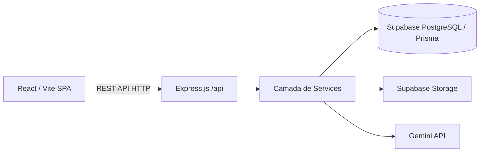

# 03 - Arquitetura

O **QEstudo** é desenvolvido como uma aplicação web Full-Stack centralizada utilizando as tecnologias mais modernas do ecossistema JavaScript/Node.js, alicerçadas em banco de dados relacional e serviços de inteligência artificial de fronteira.

## Stack Tecnológica Principal
*(Com base nas dependências e package.json reais do projeto)*
* **Frontend:** React 19 (com Vite), React Router v7, TailwindCSS v4, Lucide React (ícones), Motion (animações).
* **Backend:** Node.js (Express v5) integrado nativamente no mesmo container de build (tsx para dev, esbuild para prod).
* **Banco de Dados/ORM:** PostgreSQL (via Supabase) com Prisma ORM v5.
* **Inteligência Artificial:** Gemini API (`@google/genai`).
* **Armazenamento de Arquivos:** Supabase Storage (Buckets).
* **Processamento PDF:** `pdf-parse` / `pdf-lib` / `pdf2json`.

## Macrofluxo do Sistema

## Camadas do Código-Fonte

A base de código segue uma organização modularizada em duas frentes:

### Frontend (`/src`)
* `src/pages`: Views base conectadas às rotas principais da aplicação (Dashboard, MaterialDetails, StudySession).
* `src/components`: Componentes visuais reusáveis construídos sobre Tailwind, contendo estados locais menores, tipografia e ícones.
* `src/domain`: Definições tipadas e contratos focados no negócio no cliente.
* `src/services`: Módulos utilitários que chamam a API do backend (Fetch).

### Backend (`/server`)
* `server/routes`: Mapeamento das rotas Express expondo a API REST em `/api`.
* `server/controllers`: Lógica de entrada, parse de requisições, orquestração síncrona básica e formatação de respostas.
* `server/services`: O coração da aplicação. Contém a lógica de negócio pesada, persistência e orquestração de processamentos longos ou chamadas de IA.
  * Exemplos notáveis: `PdfProcessingService`, `ConceptMappingService`, `QuestionBatchGenerationService`, `StudyNextQuestionService`.
* `server/database`: Instâncias e configurações da camada de dados (`prisma`).
* `server/ai`: Integração isolada do SDK oficial do Google Gemini e templates de prompts.

### Database
* `prisma/schema.prisma`: Onde todo o modelo relacional de banco de dados e mapeamento do PostgreSQL está centralizado, formatado rigorosamente.
