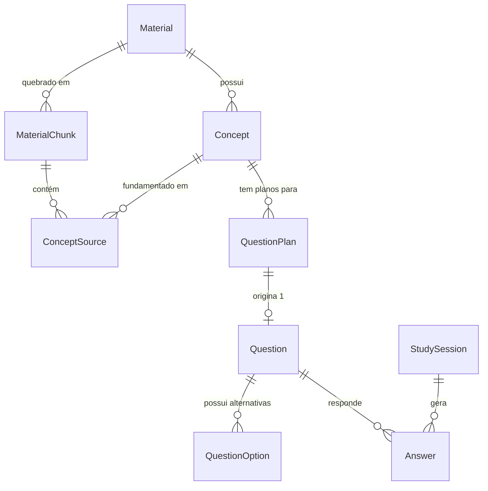

# 04 - Persistência

## Repositório e Infraestrutura
Toda a modelagem e armazenamento de dados relacionais e transacionais do QEstudo residem em um banco de dados **PostgreSQL** hospedado de forma severless e remota na nuvem (Supabase).
O acesso é feito inteiramente através do **Prisma ORM**.

**Regra Absoluta do Schema:** 
A aplicação **NÃO utiliza** o schema `public` padrão para a construção de tabelas, garantindo segurança e segmentação em caso de expansão de domínios na mesma infra. Em vez disso, todo o prisma modeliza forçadamente apontando com exclusividade para o schema `qestudo` através de anotações no Prisma e string de conexão (ex: `@@schema("qestudo")`).

## Diagrama ER Simplificado (Mermaid)

## Modelos Existentes e Finalidades

*Abaixo, uma descrição detalhada das entidades já ativas no `schema.prisma` real.*

### Núcleo de Materiais e Extração
* **`Material`**: A entidade basilar. Representa o PDF físico (seja com id, arquivo url, status de processamento, etc.).
* **`MaterialPage`**: Representa a contagem pura e caracteres das páginas originais do PDF para controle sistêmico.
* **`MaterialChunk`**: Os pedaços lógicos de texto (fragmentos menores) divididos pela engine para viabilizar e respeitar limites de tokens de leitura semântica da IA, carregando `pageStart`, `pageEnd` e `text`.

### Estrutura de Conhecimento
* **`Concept`**: Cada nó da árvore de aprendizagem (desde a *disciplina* macro, descendo para *topic*, *subtopic* até chegar ao *concept* atômico).
* **`ConceptSource`**: A ponte M:N rigorosa que informa ao sistema exatamente de quais `MaterialChunk` e em quais páginas um dado Conceito foi extraído.
* **`ConceptRelation`**: Para cenários lógicos, armazenando se um conceito possui relação ('related', 'confusable') direta com outro.

### Motor de Avaliação (Questões)
* **`QuestionPlan`**: O gabarito arquitetural do sistema antes da questão nascer. Ele trava qual será a complexidade, a posição do gabarito, tipo (Certo/Errado vs. Múltipla) e qual pedaço do texto deve basear a geração, limitando a criatividade da Inteligência Artificial.
* **`Question`**: A questão real, com enunciado (`statement`), explicação textual, e as amarrações do plano e de performance geral.
* **`QuestionValidation`**: O histórico do auditor semântico. Contém as notas se a questão tem pegadinhas justas, se não traz dados falsos fora do material e se respeita a métrica de claridade de escrita, entre outras rubricas.
* **`QuestionOption`**: A alternativa escrita. Múltipla escolha gera várias destas (`isCorrect: boolean`).
* **`QuestionSourceReference`**: Indica que aquela exata questão teve base materializada no PDF e em qual página/pedaço.
* **`QuestionBatch`**: Um "pedido" (lote) disparado pelo usuário (Ex: "Gere 5 questões sobre Presunção de Legitimidade"). Fica com o estado `processing` e agrupa a geração.

### Motor de Estudo e Sessões
* **`StudySession`**: Representa o momento que o usuário sentou à mesa. Grava de quando até quando ocorreu, modo e array de ideias/planos.
* **`Answer`**: O click final. Registra o que o usuário marcou e quanto tempo (`timeSpent`) gastou nela.
* **`ComprehensionFeedback`**: Quando um usuário erra ou clica para entender, avalia se ele "entendeu a explicação", "entendeu parcialmente" ou "continua com dúvidas" sobre a resolução.

### Métricas, Retenção e Infraestrutura
* **`ConceptMastery`**: Agrega toda performance histórica num conceito (`masteryScore`), pontuando sua sequência de acertos e o agendamento natural (intervalos de revisão).
* **`ConceptConfusionStat`**: Metadado estatístico de armadilhas mentais ("quantas vezes a pessoa confunde Ato Nulo com Ato Anulável").
* **`AIUsage`**: Tabela vital de auditoria. Tudo que for para a API Gemini (Tokens, duração, modelos e status/erros/quotas) é logado e faturado aqui para segurança da aplicação.
* **`SystemConfig`**: Chave-valor genérico para controlar painel administrativo (Ex: Limites globais diários de Orçamento/Tokens).
