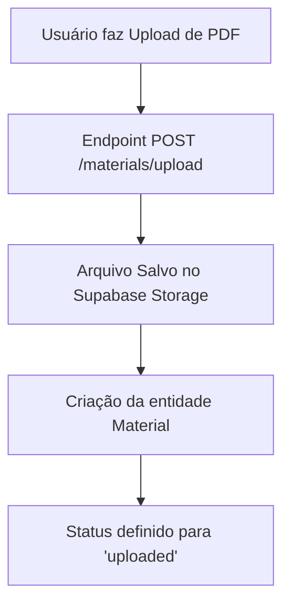
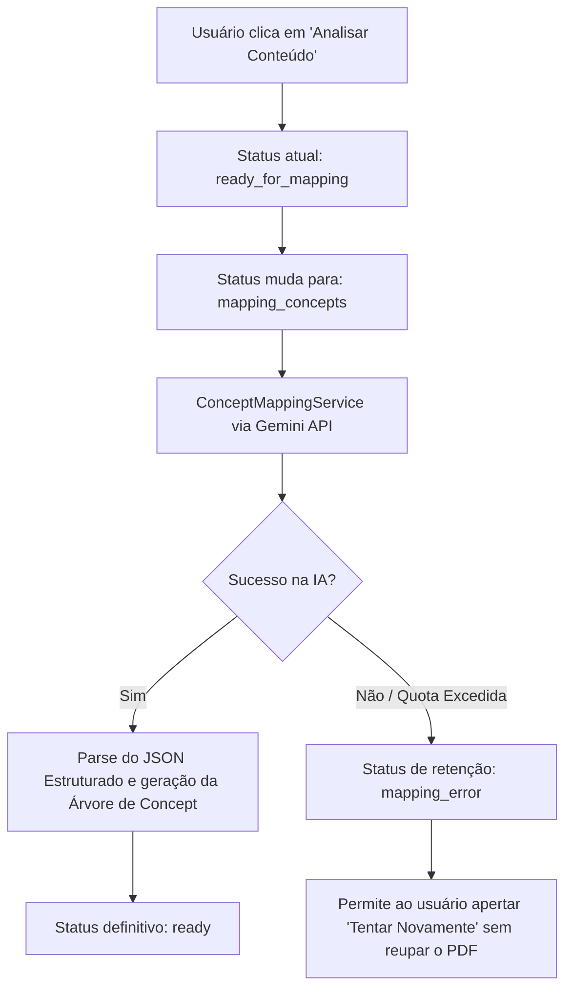
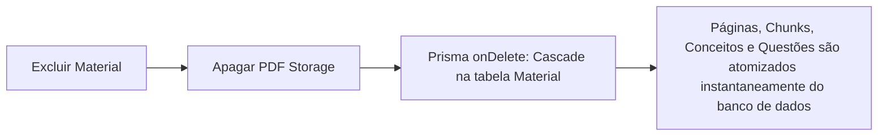

# 06 - Fluxos do Sistema

Abaixo estão as descrições dos principais fluxos funcionais (E2E) em operação dentro do **QEstudo**.

## 1. Upload e Ingestão de Material
O processo de inserir um novo conhecimento na base:



## 2. Processamento Textual (Quebra e Chunking)
Transformar o PDF binário em uma massa legível pela IA:

```mermaid
flowchart TD
    A[Status: uploaded] --> B[PdfProcessingService]
    B --> C[Status muda para: extracting]
    C --> D[Leitura de texto puro (pdf-parse / OCR eventual)]
    D --> E[Quebra do texto em páginas lógicas - MaterialPage]
    E --> F[Status muda para: chunking]
    F --> G[Criação de segmentos sintáticos com tamanho limitado - MaterialChunk]
    G --> H[Finalização do Processo Visual]
    H --> I[Status muda para: ready_for_mapping]
```

## 3. Mapeamento Semântico e Conceitual
Construção estrutural com Inteligência Artificial:



## 4. Geração em Lote de Banco de Questões
Criação sob-demanda do questionário:

```mermaid
flowchart TD
    A[Material com status 'ready'] --> B[Usuário escolhe Assunto/Disciplina, Banca e Qtd (ex: 5)]
    B --> C[Cria-se QuestionBatch em pending]
    C --> D[QuestionBatchGenerationService]
    D --> E[Status do Lote: processing]
    E --> F[Backend gera determinística de 5 QuestionPlans]
    F --> G[Envio via BatchGeneration p/ IA redigir textos e distrações]
    G --> H[Retorno da IA grava Questões primárias]
    H --> I[QuestionBatchValidatorService audita as 5 questões]
    I --> J{As questões passaram nas regras?}
    J -- Sim --> K[Questões cravadas como 'validated']
    J -- Não --> L[Questões marcadas como 'rejected']
    K --> M[Batch é concluído 'completed' ou 'partial']
```

## 5. Sessão de Estudo Dinâmica
O momento do aluno responder as perguntas finalizadas.

```mermaid
flowchart TD
    A[Aluno Inicia Sessão - Filtra Matéria ou Erros] --> B[StudySession criada]
    B --> C[StudyNextQuestionService aciona o Banco]
    C --> D{Há questões validadas não vistas?}
    D -- Não --> E[Lança erro: insufficient_question_bank]
    D -- Sim --> F[Questão Apresentada ao aluno na UI]
    F --> G[Aluno submete alternativa escolhida]
    G --> H[Backend valora IsCorrect no banco via controller]
    H --> I[Aluno lê Explicação com Feedback (Entendi / Não entendi)]
    I --> J[Aluno avança para Próxima Questão]
    J --> C
```

## 6. Destruição de Dados
O processo irreversível de deleção, seguindo princípios severos do regulamento:


